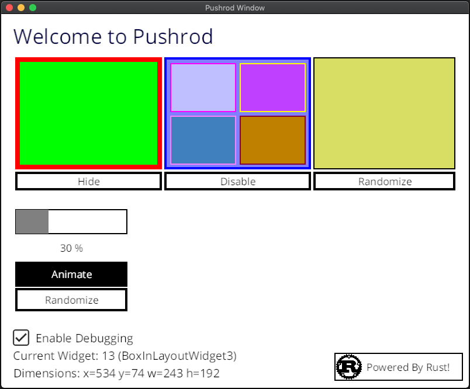

# rust-pushrod

## Project Description

[](https://travis-ci.org/KenSuenobu/rust-pushrod)
[](https://crates.io/crates/rust-pushrod)
[](https://docs.rs/rust-pushrod)

**Cross Platform UI Widget Library for Rust that uses OpenGL as its rendering engine.**

Draws inspiration from lots of GUI libraries.

## (Ever Evolving) Screenshot of Sample

[](docs/sample-0.3.7.png)

## Philosophy

The reason I created this library instead of extending another library was that
I wanted to keep these specific design ideas in mind:

- Maintainable with little effort
- Easily extensible
- Lightweight enough to run on minimalist hardware
- **Easy to use and understand**

These design ideas are critical.  **Keep it simple.  Keep it stupid simple.**

## Prerequisites for Pushrod

Pushrod requires the following minimum versions:

| Library | Version |
| ------- | ------- |
| piston_window | 0.89 |
| piston2d-opengl_graphics | 0.59 |
| piston2d-graphics | * |
| pistoncore-glfw_window | 0.49 |
| gl | * |

## Optimization Note

To see what the CPU usage looked like before and after switching between 2D and 3D rendering engines,
[here is before](docs/cpu_before.png), and [this is after](docs/cpu_after.png).  These numbers represent the
current version (0.3.x) before any rendering optimizations have been added.

So, is it worth it to add OpenGL?  I'll let you decide.

## Runnable Examples

### Pre-Requisite for Mac OS X

You should use `brew` on your system.  If you have Homebrew already installed, use `brew install glfw` to 
install the `GLFW` formula.

### Pre-requisite for Linux

... TBD ...

### Pre-requisite for Windows

... TBD ...

## After installing pre-requisites:

```
cargo run --example simple
```

This will run the simple application demo.  It's interactive, so have fun!
